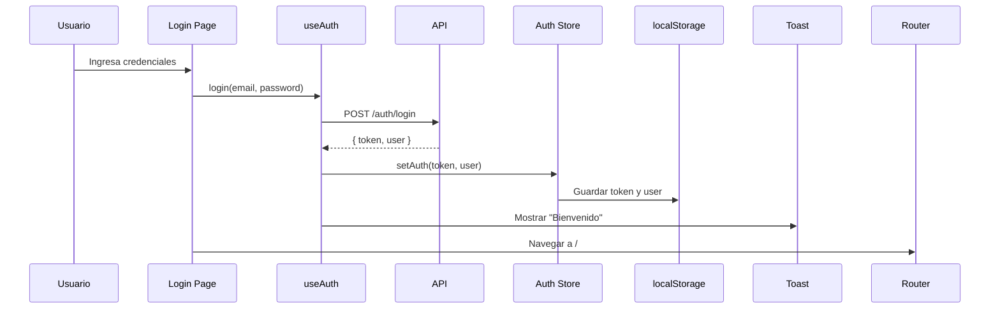
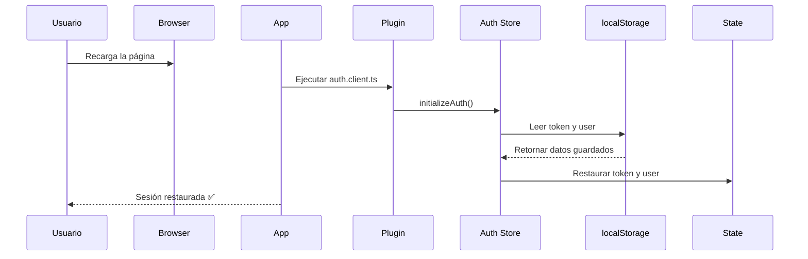
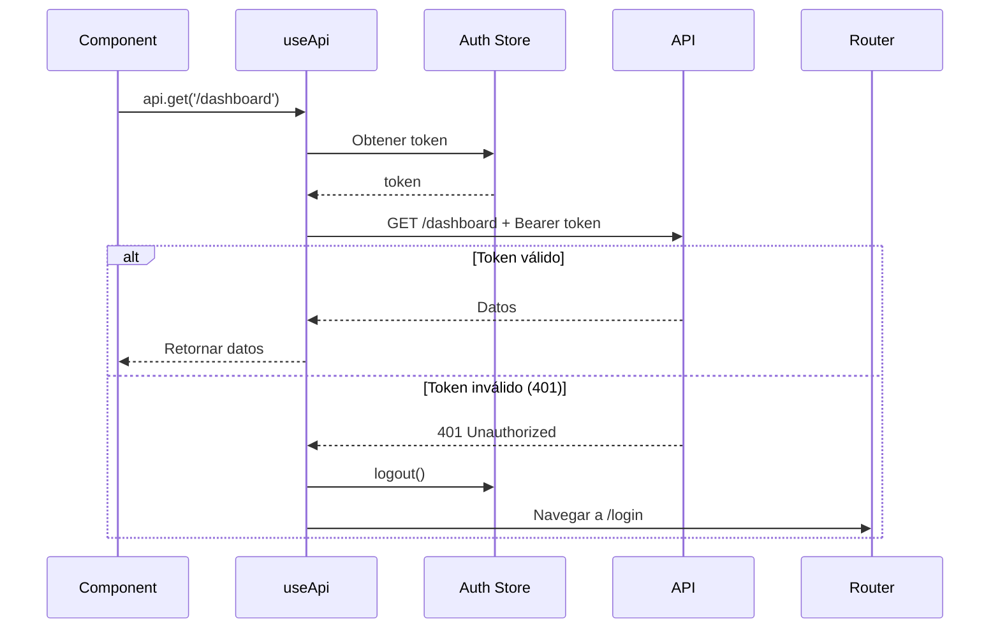
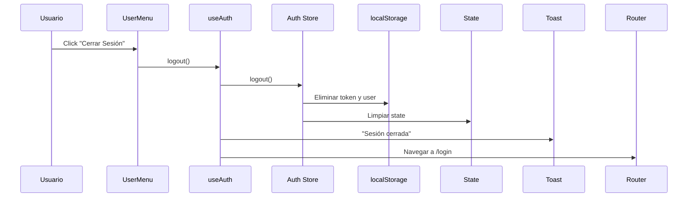

# 🔐 Sistema de Autenticación - Balconcito ERP

## Descripción General

El sistema de autenticación está implementado con **Pinia** para el manejo de estado y **localStorage** para la persistencia de sesión. Esto permite que los usuarios permanezcan autenticados incluso al recargar la página.

## Arquitectura

### 📦 Store de Autenticación (`/app/stores/auth.ts`)

El store de Pinia maneja todo el estado de autenticación:

```typescript
interface AuthState {
  token: string | null
  user: User | null
}
```

**Getters:**
- `isAuthenticated`: Verifica si hay token y usuario
- `currentUser`: Devuelve el usuario actual
- `userRole`: Devuelve el rol del usuario

**Actions:**
- `setAuth(token, user)`: Guarda token y usuario en el store y localStorage
- `logout()`: Limpia el estado y localStorage
- `initializeAuth()`: Restaura la sesión desde localStorage al iniciar

### 🔧 Composable useAuth (`/app/composables/useAuth.ts`)

Proporciona funciones reutilizables para la autenticación:

```typescript
const { login, logout, checkAuth, user, isAuthenticated, userRole } = useAuth()
```

**Funciones:**
- `login(email, password)`: Autentica al usuario y guarda la sesión
- `logout()`: Cierra sesión y redirige al login
- `checkAuth()`: Verifica la validez del token con el backend

**Características:**
- Notificaciones toast automáticas en login/logout
- Manejo de errores centralizado
- Redirección automática

### 🌐 Composable useApi (`/app/composables/useApi.ts`)

Wrapper de $fetch que incluye automáticamente el token JWT:

```typescript
const api = useApi()

// El token se incluye automáticamente en las cabeceras
await api.get('/dashboard/summary')
await api.post('/expenses', expenseData)
```

**Características:**
- Añade automáticamente el token a todas las peticiones
- Maneja errores 401 (token inválido) automáticamente
- Cierra sesión y redirige si el token expira

### 🔌 Plugin de Inicialización (`/app/plugins/auth.client.ts`)

Se ejecuta al cargar la aplicación en el cliente:

```typescript
export default defineNuxtPlugin(async () => {
  const authStore = useAuthStore()

  // Restaura la sesión desde localStorage
  authStore.initializeAuth()
})
```

### 🛡️ Middleware de Autenticación (`/app/middleware/auth.ts`)

Protege las rutas que requieren autenticación:

```typescript
definePageMeta({
  middleware: ['auth'],
  requiresAuth: true
})
```

**Funcionalidad:**
- Redirige a `/login` si no hay sesión
- Redirige a `/` si el usuario autenticado intenta acceder a `/login`

## Flujo de Autenticación

### 1. Login



### 2. Persistencia de Sesión



### 3. Peticiones Autenticadas



### 4. Logout



## Estructura de localStorage

```javascript
// Datos guardados en localStorage
{
  "auth_token": "eyJhbGciOiJIUzI1NiIsInR5cCI6IkpXVCJ9...",
  "auth_user": "{\"id\":1,\"email\":\"daniel@balconcito.com\",\"name\":\"Daniel\",\"role\":\"admin\"}"
}
```

## Uso en Componentes

### Verificar si el usuario está autenticado

```vue
<script setup>
const { isAuthenticated, user } = useAuth()
</script>

<template>
  <div v-if="isAuthenticated">
    <p>Hola, {{ user.name }}!</p>
  </div>
</template>
```

### Proteger una página

```vue
<script setup>
definePageMeta({
  middleware: ['auth'],
  requiresAuth: true
})
</script>
```

### Hacer peticiones autenticadas

```vue
<script setup>
const api = useApi()

const loadData = async () => {
  // El token se incluye automáticamente
  const data = await api.get('/expenses')
}
</script>
```

### Cerrar sesión

```vue
<script setup>
const { logout } = useAuth()

const handleLogout = () => {
  logout() // Cierra sesión y redirige
}
</script>

<template>
  <UButton @click="handleLogout">
    Cerrar Sesión
  </UButton>
</template>
```

## Componentes de UI

### UserMenu

Muestra el usuario actual con su avatar (iniciales) y opciones:
- Configuración
- Cambiar apariencia (claro/oscuro)
- Cambiar color principal
- Cerrar sesión

```vue
<UserMenu :collapsed="false" />
```

### TeamsMenu

Muestra la organización (Balconcito):

```vue
<TeamsMenu :collapsed="false" />
```

## Seguridad

### ✅ Características de Seguridad

1. **Token JWT**: Autenticación basada en tokens
2. **Persistencia segura**: localStorage solo en cliente
3. **Validación automática**: Detección de tokens inválidos
4. **Logout automático**: Si el token expira (401)
5. **HTTPS requerido**: En producción

### ⚠️ Consideraciones

- Los tokens no se cifran en localStorage (asume HTTPS)
- No hay refresh tokens implementados aún
- El token debe tener una expiración razonable en el backend

## Validación del Token (Opcional)

Si quieres validar el token cada vez que se recarga la página, descomenta en `/app/plugins/auth.client.ts`:

```typescript
if (authStore.isAuthenticated) {
  const { checkAuth } = useAuth()
  await checkAuth()
}
```

**Ventajas:**
- Detecta tokens expirados inmediatamente
- Actualiza los datos del usuario

**Desventajas:**
- Petición extra al backend en cada recarga
- Puede ser más lento

## Testing Manual

### 1. Login
1. Ir a `/login`
2. Ingresar credenciales válidas
3. Verificar que redirige a `/`
4. Ver el nombre del usuario en el menú

### 2. Persistencia
1. Estar logueado
2. Recargar la página (F5)
3. Verificar que sigue logueado
4. Verificar que el nombre del usuario sigue visible

### 3. Logout
1. Estar logueado
2. Click en el menú de usuario
3. Click en "Cerrar Sesión"
4. Verificar que redirige a `/login`
5. Verificar que no puede acceder a rutas protegidas

### 4. Token Inválido
1. Estar logueado
2. Abrir DevTools → Application → localStorage
3. Modificar manualmente el `auth_token`
4. Hacer una petición a la API
5. Verificar que cierra sesión automáticamente

## Troubleshooting

### La sesión no persiste al recargar

**Posibles causas:**
- El plugin no se está ejecutando
- Error al parsear el JSON de localStorage
- El navegador está en modo privado

**Solución:**
- Verificar que `auth.client.ts` existe en `/app/plugins/`
- Revisar la consola del navegador para errores
- Verificar localStorage en DevTools

### Token expirado pero no cierra sesión

**Causa:**
- El backend devuelve un error diferente a 401

**Solución:**
- Asegurar que el backend devuelve 401 para tokens inválidos
- Verificar el manejo de errores en `useApi.ts`

### No redirige después del login

**Causa:**
- Error en la función de login
- Router no funciona correctamente

**Solución:**
- Revisar la consola para errores
- Verificar que `router.push('/')` se ejecuta
- Asegurar que la ruta `/` existe

## Referencias

- [Pinia Documentation](https://pinia.vuejs.org/)
- [Nuxt Auth Best Practices](https://nuxt.com/docs/guide/directory-structure/middleware)
- [JWT Best Practices](https://tools.ietf.org/html/rfc7519)
